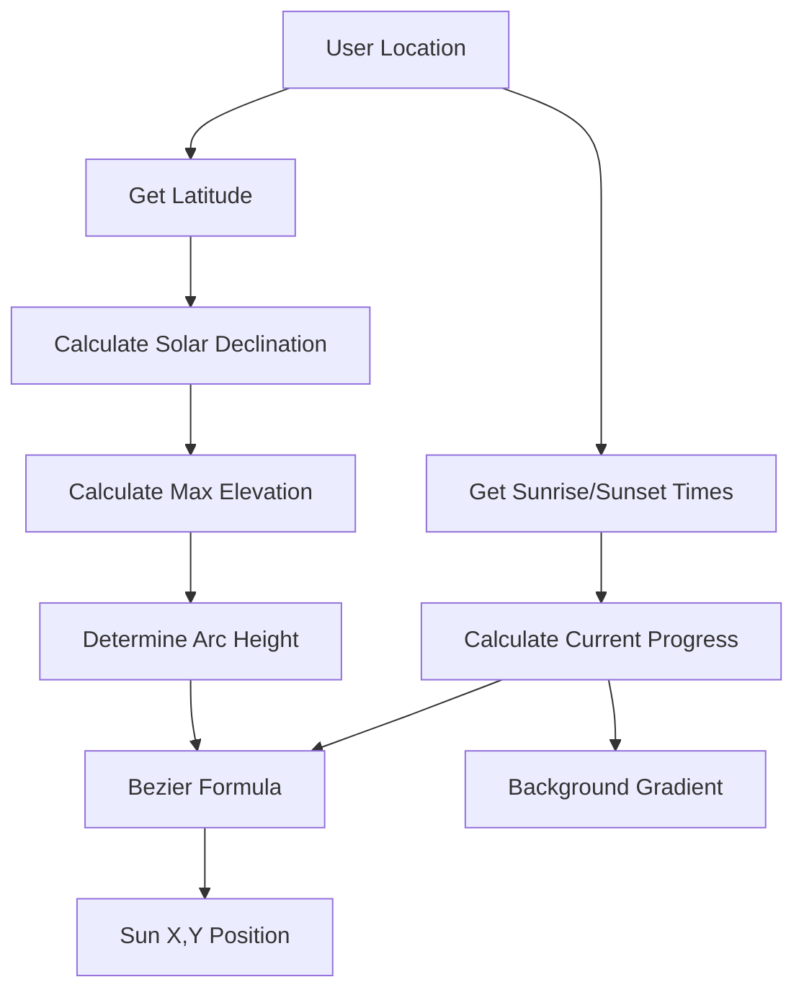

# Sun Position Card: The Math Behind the Visualization

This document explains the mathematical concepts used in the `SunPositionCard` component to accurately visualize the sun's path across the sky.

## Overview

The visualization combines three key mathematical concepts:
1. **Quadratic Bezier Curves** - for smooth arc rendering
2. **Solar Geometry** - for season-aware arc height
3. **Time Mapping** - for accurate sun positioning

---

## 1. Quadratic Bezier Curve

The sun's arc is drawn using a **quadratic Bezier curve** with three control points:

```
P₀ = (startX, centerY)     ← Sunrise position (left, on horizon)
P₁ = (centerX, controlY)   ← Control point (above center, determines peak)
P₂ = (endX, centerY)       ← Sunset position (right, on horizon)
```

### The Bezier Formula

For any progress value `t` between 0 and 1:

$$B(t) = (1-t)^2 \cdot P_0 + 2(1-t)t \cdot P_1 + t^2 \cdot P_2$$

Expanding for X and Y coordinates:

```javascript
x = (1-t)² × startX + 2(1-t)t × centerX + t² × endX
y = (1-t)² × centerY + 2(1-t)t × controlY + t² × centerY
```

### Key Properties

| Progress (t) | Position | Time of Day |
|--------------|----------|-------------|
| 0 | Left endpoint | Sunrise |
| 0.5 | Peak of arc | Solar noon |
| 1 | Right endpoint | Sunset |

The curve naturally starts flat, rises to a smooth peak, and returns flat - perfect for representing the sun's apparent motion.

---

## 2. Solar Zenith Calculation

The arc height varies by season and location because the sun reaches different maximum elevations throughout the year.

### Step 1: Calculate Day of Year

```javascript
dayOfYear = Math.floor(
  (date - new Date(year, 0, 0)) / (1000 × 60 × 60 × 24)
)
```

### Step 2: Solar Declination

The Earth's axial tilt (23.45°) causes the sun to appear higher or lower throughout the year:

$$\delta = -23.45° \times \cos\left(\frac{2\pi \times (d + 10)}{365}\right)$$

Where `d` is the day of year.

| Date | Declination | Season |
|------|-------------|--------|
| June 21 | +23.45° | Summer Solstice |
| Dec 21 | -23.45° | Winter Solstice |
| Mar/Sep 21 | 0° | Equinoxes |

### Step 3: Maximum Solar Elevation

The highest point the sun reaches at solar noon:

$$\alpha_{max} = 90° - |\phi - \delta|$$

Where:
- `φ` = observer's latitude
- `δ` = solar declination

### Example: San Francisco (37.7°N)

**Winter (January):**
```
δ ≈ -21°
α_max = 90° - |37.7° - (-21°)| = 90° - 58.7° ≈ 31°
```

**Summer (June):**
```
δ ≈ +23.45°
α_max = 90° - |37.7° - 23.45°| = 90° - 14.25° ≈ 76°
```

### Step 4: Scale to Arc Height

```javascript
zenithScale = Math.max(0.2, Math.min(1, maxElevation / 75))
peakHeight = 30 + 45 × zenithScale  // Range: 30-75 pixels
```

This creates a flatter arc in winter (~31° elevation) and a taller arc in summer (~76° elevation).

---

## 3. Sun Position Along the Arc

### Calculate Progress

The sun's progress through the day is a simple linear interpolation:

$$progress = \frac{t_{current} - t_{sunrise}}{t_{sunset} - t_{sunrise}}$$

### Example

If sunrise is 7:00 AM, sunset is 5:00 PM, and current time is 11:00 AM:

```
progress = (11 - 7) / (17 - 7) = 4 / 10 = 0.4
```

This `progress` value (0.4) is then used as `t` in the Bezier formula to get the sun's exact screen position.

---

## 4. Dynamic Background Colors

The background gradient changes based on the same progress value:

| Progress | Phase | Colors |
|----------|-------|--------|
| < 0.15 | Dawn | Rose → Orange |
| 0.15-0.35 | Morning | Sky → Amber |
| 0.35-0.65 | Midday | Blue → Sky |
| 0.65-0.85 | Afternoon | Amber → Orange |
| > 0.85 | Dusk | Orange → Purple |
| Night | Night | Slate → Indigo |

---

## Summary



The combination of accurate astronomical calculations with smooth Bezier curve rendering creates a visualization that is both scientifically accurate and visually elegant.
